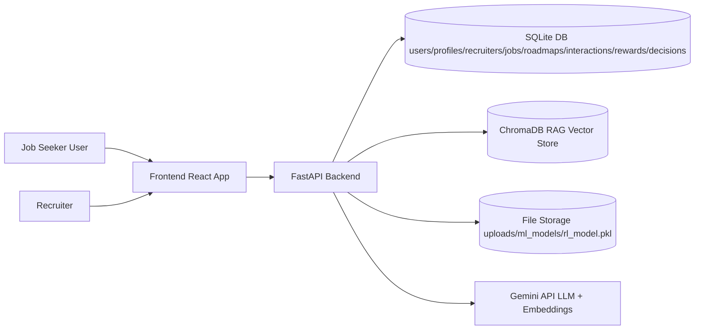
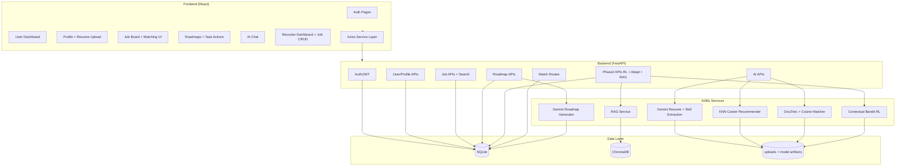
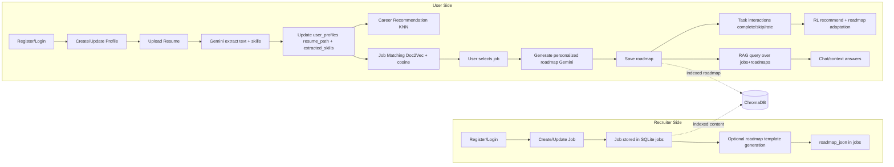
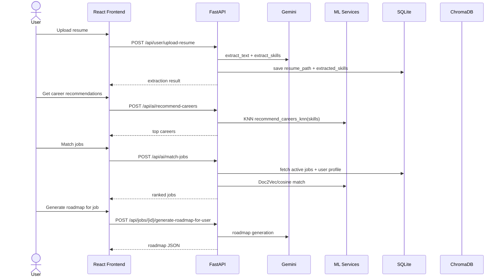

# PathFinder AI — Simplified AI-Powered Academic & Career Assistant

**Full project report (Markdown)** — aligned with the implemented codebase, diagrams, tables, and offline evaluation results.

**Institution (from project draft):** Amrita School of Computing, Amrita Vishwa Vidyapeetham, Amritapuri Campus  

**Submitted by:** Aditya Kaashyap Emani (AM.EN.U4CSE22007), Nirujogi Sai Jayanth (AM.EN.U4CSE22037), Intha Madhav Reddy (AM.EN.U4CSE22069)  

**Guide:** Bri Krishnaprasad T R  

**Document version:** 2.0 (technical reconciliation with repository, May 2026)

---

## Bonafide certificate and declaration

*The signed PDF / Word submission should retain the official Bonafide Certificate and Declaration pages exactly as approved by the department. This Markdown export includes the technical body of the report only.*

---

## Acknowledgements

We extend our sincere gratitude to our Project Guide, **Bri Krishnaprasad T R**, for consistent guidance and detailed feedback. We thank our Coordinator, **Preethi S Nair**, and **Dr. Swaminathan J**, Chairperson, Department of CSE. We are grateful to **Amrita School of Computing** for resources and facilities.

---

## Abstract

This project presents **PathFinder AI**, a career guidance and job-readiness web platform that connects user capabilities with industry-style job postings and learning plans. The system uses a **React** frontend and a **FastAPI** backend with **SQLite** persistence and optional **ChromaDB** vector storage for retrieval-augmented assistance.

**Resume understanding** combines file text extraction with **Google Gemini** for structured skill extraction. **Career recommendation** uses **K-Nearest Neighbors (KNN)** with a **MultiLabelBinarizer** over a career–skill reference table. **Job matching** is implemented at three levels: (1) a **Doc2Vec** embedding baseline with **cosine similarity** and a **70% / 30%** blend with explicit skill overlap for ranking jobs from the database (`POST /api/ai/match-jobs`); (2) **Model 1**, an **XGBoost** classifier that labels extracted JD skills by importance (`core`, `important`, `supporting`, `optional`); (3) **Model 2**, an **XGBoost** classifier that predicts overall **user–job fit** (`high_fit`, `medium_fit`, `low_fit`) from engineered features including Model 1 outputs (`POST /match-user-job`, `POST /recommend-jobs`).

**Personalized roadmaps** are generated with **Gemini 2.5 Flash** as structured JSON (gap analysis, phased tasks). **Adaptive roadmap behavior** uses a **contextual bandit** (linear reward model, **ε-greedy**, ε = **0.15**) with **seven** roadmap-edit actions—not full MDP reinforcement learning—updated from **task** interactions (`complete`, `skip`, `rate_difficulty`) via **Phase 2** APIs. **RAG** optionally grounds chat and retrieval over indexed jobs and roadmaps.

Offline evaluation reports **high accuracy** for Model 1 and Model 2 on held-out test splits (see Section 5.3). The platform supports **recruiters** with enhanced job CRUD and search, and **users** with dashboards, job boards, roadmaps, and AI chat.

**Keywords:** Career recommendation, job matching, Doc2Vec, XGBoost, skill importance, contextual bandit, RAG, Gemini, FastAPI, React, explainable fit.

---

## Table of contents

1. [Introduction](#1-introduction)  
2. [Problem definition](#2-problem-definition)  
3. [Related work](#3-related-work)  
4. [Proposed system](#4-proposed-system)  
5. [Testing and result analysis](#5-testing-and-result-analysis)  
6. [Conclusion and future work](#6-conclusion-and-future-work)  
7. [References](#7-references)  
8. [Appendix](#8-appendix)  

**List of figures:** embedded as **Figure X** with Mermaid source.  
**List of tables:** Table 2.1–5.3 in Section 2.6 and 5.

---

## 1. Introduction

### 1.1 Background of the study

Modern job markets reward continuous learning and rapid skill refresh. Traditional portals emphasize listings and filters; they often under-deliver on **personalized** guidance, **structured learning paths**, and **explainable** fit to a specific job description. PathFinder AI targets students and job seekers who need an integrated loop: profile → resume → careers → jobs → **gap-aware roadmap** → practice tasks with **feedback-driven** adaptation.

### 1.2 Problem statement

Key gaps addressed: (1) weak personalization when only keywords are used; (2) limited **skill-gap** narrative tied to a concrete role; (3) fragmented tools (resume, jobs, learning) in separate products; (4) lack of **transparent** fit beyond a single score; (5) static roadmaps that do not respond when a task is too hard or irrelevant.

### 1.3 Objectives of the study

1. Build a **full-stack** platform (React + FastAPI + SQLite) with JWT auth for **users** and **recruiters**.  
2. Implement **resume upload** and **Gemini-based** skill extraction.  
3. Deliver **KNN-based** career recommendations from user skills.  
4. Implement **Doc2Vec** semantic ranking of database jobs plus **hybrid** skill overlap.  
5. Train and deploy **Model 1** (JD skill importance) and **Model 2** (user–job fit) as **XGBoost** classifiers with offline metrics.  
6. Generate **Gemini** JSON roadmaps per job and user; allow **save**, **regenerate task**, and **Phase 2** contextual bandit **adaptation**.  
7. Provide **RAG** and **chat** hooks for context-aware assistance where configured.

### 1.4 Architecture overview (Figure 1.1)

**Figure 1.1 — Overall system context**



The user interface talks to FastAPI over HTTPS/JSON. The backend persists relational data in SQLite, optional vectors in ChromaDB, artifacts (KNN, Doc2Vec, XGBoost pickles, bandit weights) on disk, and calls Gemini for LLM-heavy steps.

### 1.5 Summary

Chapter 1 framed the employment guidance problem and listed objectives aligned with the repository. Chapter 2 sharpens requirements and comparison to generic portals. Chapter 3 situates the work in AI/ML career assistance literature. Chapter 4 details architecture and modules **as implemented**. Chapters 5–6 cover validation, **offline model results**, conclusions, and future work.

---

## 2. Problem definition

### 2.1 Introduction to the problem domain

Students must map coursework and projects to **employer-visible** skills and JD language. PathFinder AI reduces friction by centralizing profile data, JD-aware matching, and learning roadmaps.

### 2.2 Limitations of existing systems

Generic job boards: keyword search, limited explanation, no integrated roadmap. Many “AI career” demos lack persisted **feedback loops** or reproducible **offline** model metrics.

### 2.3 Need for an intelligent integrated system

A single product should connect: **evidence of skills** (resume + profile) → **role discovery** (KNN careers) → **job discovery** (Doc2Vec + ML fit) → **learning plan** (Gemini roadmap) → **adaptation** (contextual bandit on task events).

### 2.4 Key challenges

- Noisy resumes and heterogeneous JDs.  
- Cold start for new users with sparse profiles.  
- Balancing **exploration** in the bandit without destabilizing the roadmap.  
- Keeping **RAG** index fresh when jobs/roadmaps change.

### 2.5 Functional requirements

- Register/login; profile CRUD; resume PDF/DOC.  
- Career recommendations; job board + search; job matching.  
- Skill gap and strengths/weaknesses (Gemini-assisted).  
- Roadmap generation, save (max three per user), task regenerate.  
- Phase 2: log interaction, recommend adaptation, apply adaptation, RAG query.

### 2.6 Comparative analysis (Table 2.1)

**Table 2.1 — Existing systems vs PathFinder AI (implementation-aligned)**

| Feature | Typical portals / static tools | PathFinder AI (implemented) |
|--------|----------------------------------|-----------------------------|
| Personalization | Filters, keywords | Profile + resume text; KNN careers; Doc2Vec job vectors; optional XGBoost fit |
| Skill gap | Rare or manual | Gemini narrative + roadmap `gap_analysis` JSON |
| Learning path | None or static PDF | Gemini phased roadmap + task regenerate |
| Explainable job fit | Single score or none | Model 1 importance labels; Model 2 label + `critical_missing_skills` + feature map |
| Semantic job match | TF-IDF or none | Doc2Vec + cosine + hybrid skill term |
| Adaptive behavior | None | Contextual bandit on **roadmap tasks** (7 actions), not generic job-click RL |
| Recruiter side | Posting only | Enhanced jobs + optional template roadmap |
| Context chat | Rules | Gemini + optional RAG over jobs/roadmaps |

---

## 3. Related work

### 3.1 AI-based resume analysis and job recommendation

Industry practice combines parsing with classifiers or embeddings. PathFinder AI uses **LLM extraction** (Gemini) for robustness to layout and phrasing, plus **Doc2Vec** for lightweight semantic similarity suitable for a student project deployment without mandatory GPU.

### 3.2 Machine learning for career and fit prediction

**Gradient-boosted trees (XGBoost)** are used for **structured tabular** features derived from JD parsing and user overlap—an interpretable complement to dense embeddings.

### 3.3 RAG, LLMs, and bandits

**RAG** grounds responses in local job/roadmap chunks (ChromaDB). **Contextual bandits** are standard for **sequential decision** problems with **immediate reward**; they avoid the sample complexity of full RL when the product decision is “which local roadmap edit?” per feedback event.

---

## 4. Proposed system

### 4.1 Overview

PathFinder AI is a modular SPA plus REST API. Intelligence is split into **deterministic / classical ML** (KNN, Doc2Vec, XGBoost) and **LLM** services (Gemini for resume, roadmap, chat, gap narrative). **Phase 2** isolates logging, recommendation, adaptation, and RAG.

### 4.2 System architecture (Figure 4.1)

**Figure 4.1 — Layered architecture (container view)**



### 4.3 Functional modules (Table 4.1)

**Table 4.1 — System modules and functions**

| Module | Function |
|--------|----------|
| User management | JWT auth; user/recruiter registration and login |
| Profile & resume | CRUD profile; upload PDF/DOC; Gemini text + skills |
| Career recommendation | KNN + MLB on `career_reference.pkl` |
| Baseline job matching | Doc2Vec infer + cosine + hybrid skill score; `/api/ai/match-jobs` |
| ML job fit (Model 1) | JD → skills + importance labels; `/analyze-jd` |
| ML job fit (Model 2) | User + JD → fit label, confidence, critical gaps; `/match-user-job`, `/recommend-jobs` |
| Skill gap analysis | Top-1 career skills + Gemini narrative |
| Roadmap generation | Gemini JSON; per-job user + recruiter template endpoints |
| Roadmap storage | Save/list/delete; max 3 roadmaps; task regenerate |
| Phase 2 bandit | Log → reward → update `rl_model.pkl`; recommend; adapt JSON |
| RAG & chat | Chroma query; Gemini chat with user context |
| Recruiter jobs | Enhanced create, search, update, close |

### 4.4 Workflow (Figure 4.2)

**Figure 4.2 — User and recruiter workflow**



**Figure 4.3 — Runtime sequence (core API calls)**



### 4.5 Implementation details (concise)

| Component | Key files |
|-----------|-----------|
| API entry | `backend/app/main.py` (routers: `job_router`, `phase2_router`, `match_router`) |
| Career + Doc2Vec | `backend/app/services/ml/career_ml.py` |
| Model 1 / 2 | `backend/app/services/model1_service.py`, `model2_service.py`, `match_routes.py` |
| Roadmap LLM | `backend/app/services/roadmap/job_roadmap.py`, `job_roadmap_service.py` |
| Bandit | `backend/app/services/rl/bandit.py`, `phase2_routes.py`, `roadmap_adaptation.py` |
| RAG | `backend/app/services/rag/chroma_rag.py`, `seed_rag.py` |
| Frontend | `frontend/src/pages/...`, `frontend/src/services/api.js` |

**Training scripts:** `models/model1_skill_importance/train_model1.py`, `models/model2_job_fit/train_model2.py`  

**Datasets (examples):** `datasets/skill_importance_labeled.csv`, `datasets/user_job_fit_balanced.csv`, `datasets/skills.json`

### 4.6 Performance evaluation framework (Table 4.2)

**Table 4.2 — Metrics used for ML modules**

| Metric | Description |
|--------|-------------|
| Accuracy | Correct classification (Model 1 / Model 2) |
| Macro precision / recall / F1 | Unweighted mean across classes |
| Per-class precision/recall/F1 | From `classification_report` in `metrics.txt` |
| Response time | Qualitative: local API typical sub-second for ML inference once models loaded |
| Bandit | Online: reward logs and `RoadmapBanditDecision` rows (no single offline accuracy) |

---

## 5. Testing and result analysis

### 5.1 Testing strategy

- **Unit / manual API tests:** FastAPI `/docs`, script `backend/scripts/test_match_endpoints.py` for `/analyze-jd`, `/match-user-job`, `/recommend-jobs`.  
- **Integration:** React to backend with JWT; job search and roadmap save flows.  
- **Adaptive flow:** `backend/scripts/e2e_adaptive_roadmap_flow.py` (debug flag for forced actions).  
- **Data quality:** `backend/scripts/audit_e2e.py` producing `audit_report.json`.

### 5.2 User interface testing (Figure placeholders)

**Figure 5.1** — *Insert screenshot:* User dashboard (`Dashboard.js`) showing profile/resume status.  

**Figure 5.2** — *Insert screenshot:* Job matching page (`JobMatching.js`) showing profile-completion warning when data insufficient.  

**Figures 5.3–5.5** — *Insert screenshots:* High / medium / low fit presentation. **Note:** Primary UI uses **Doc2Vec** list from `/api/ai/match-jobs`. For **Model 2** high/medium/low visuals, use API tool (Postman) or a small UI binding to `/recommend-jobs` if added later.

### 5.3 Offline model results (Tables 5.2 and 5.3)

**Table 5.2 — Model 1 (skill importance) — test set (`models/model1_skill_importance/metrics.txt`)**

| Metric | Value |
|--------|------:|
| Accuracy | 0.9860 |
| Macro precision | 0.9782 |
| Macro recall | 0.9683 |
| Macro F1 | 0.9732 |

| Class | Precision | Recall | F1-score | Support |
|-------|-----------|--------|----------|--------:|
| core | 0.98 | 0.95 | 0.97 | 44 |
| important | 0.96 | 0.94 | 0.95 | 143 |
| optional | 1.00 | 0.99 | 0.99 | 766 |
| supporting | 0.98 | 0.99 | 0.99 | 904 |
| **Total** | — | — | accuracy **0.99** | **1857** |

**Table 5.3 — Model 2 (user–job fit) — test set (`models/model2_job_fit/metrics.txt`)**

| Metric | Value |
|--------|------:|
| Accuracy | 0.9235 |
| Macro precision | 0.9269 |
| Macro recall | 0.9278 |
| Macro F1 | 0.9272 |

| Class | Precision | Recall | F1-score | Support |
|-------|-----------|--------|----------|--------:|
| high_fit | 0.96 | 0.98 | 0.97 | 11436 |
| low_fit | 0.93 | 0.94 | 0.93 | 26679 |
| medium_fit | 0.90 | 0.86 | 0.88 | 18208 |
| **Total** | — | — | accuracy **0.92** | **56323** |

### 5.4 Weighted / importance-aware job fit (conceptual)

Model 1 supplies **importance-aware** skill rows; Model 2 aggregates **matched vs missing** counts by importance and combines experience and profile–JD similarity features. This matches the draft’s “weighted job-fit” intent while naming the **two-model** realization.

### 5.5 System-level observations (Table 5.1)

**Table 5.1 — Qualitative system evaluation**

| Aspect | Observation |
|--------|-------------|
| Job matching (Doc2Vec) | Stable when profile text + JD text are non-empty |
| ML APIs | Model 1/2 return structured JSON suitable for dashboards |
| Roadmaps | Require `GEMINI_API_KEY`; JSON schema validated in UI |
| Bandit | Improves with logged interactions; cold start exploratory |
| Limitations | Sparse profiles reduce quality; match routes should be auth-wrapped in production |

---

## 6. Conclusion and future work

### 6.1 Conclusion

PathFinder AI delivers an integrated **student-oriented** career assistant: **Gemini** resume and roadmap generation, **KNN** careers, **Doc2Vec** job discovery, **XGBoost** explainable fit pipeline, **Phase 2** contextual bandit roadmap adaptation, and optional **RAG**. Offline metrics for Model 1 and Model 2 are **strong on held-out data**, supporting the design choice of tabular features plus boosting.

### 6.2 Future work

- Secure `/analyze-jd`, `/match-user-job`, `/recommend-jobs` behind JWT or internal network.  
- Optional UI for Model 2 rankings alongside Doc2Vec results.  
- PostgreSQL migration; async job queue for RAG indexing.  
- Deep retrieval encoders (e.g. sentence-BERT end-to-end ranking) as an alternative or re-ranker.  
- User studies and live metrics for bandit regret / task completion rate.

---

## 7. References

*[Retained from draft submission; replace with domain-specific citations as advised by your guide.]*

1. S. L. Thompson and E. R. Müller, “A Decentralized Freelancing Marketplace with Ethereum Smart Contracts and AI-Based Job Matching,” in Proc. IEEE Conf. Blockchain Applications in Digital Economy, Berlin, Germany, 2025.  
2. H. Xu et al., “Quantum Reinforcement Learning for Real-Time Optimization in Electric Vehicle Charging Systems,” *Applied Energy*, vol. 360, 2025.  
3. C. Li et al., “Enhancing Information Credibility Assessment Through AI: A Personality-Aware Fake News Detection Model Using BERT,” *The Electronic Library*, 2026.  
4. J. Maharjan et al., “Intersection of Big Five Personality Traits and Substance Use on Social Media Discourse,” *JMIR*, vol. 27, 2025.  
5. S. Noori, “Predictive Modeling of Emotional and Behavioral Patterns Using AI Web-Based Systems,” *Diqiu Kexue*, vol. 49, no. 2, 2025.  
6. B. Sarikaya and A. Küçükmanİsa, “TB5I: A Multimodal Turkish Interview Dataset…,” *IEEE Access*, 2026.  
7. F. Rossi et al., “Reinforcement Learning for Adaptive Decision-Making in Smart Systems,” *Energies*, vol. 18, no. 19, 2025.  
8. P. Gandhi et al., “SynCard: Smart Digital Business Card Using AI-Based Systems,” *IJEDR*, vol. 13, no. 4, 2025.  
9. R. Putchakayala and V. K. Yarram, “Adaptive Trust Engineering: AI-Driven Risk Assessment Models,” *IJACS*, 2025.  
10. D. Drofa, “Optimization of Software Development Processes Using Full-Stack Technologies and Automation,” *Contemporary Issues in AI*, vol. 1, 2025.  

---

## 8. Appendix

### 8.1 Abbreviations

| Abbreviation | Meaning |
|--------------|---------|
| AI | Artificial intelligence |
| ML | Machine learning |
| NLP | Natural language processing |
| RAG | Retrieval-augmented generation |
| RL | Reinforcement learning (here: contextual bandit for roadmaps) |
| API | Application programming interface |
| UI | User interface |
| DB | Database |
| JWT | JSON Web Token |
| LLM | Large language model |
| JD | Job description |
| KNN | K-nearest neighbors |
| XGB | XGBoost gradient boosting |

### 8.2 Key REST endpoints (Table A.1)

**Table A.1 — Representative API routes**

| Method | Path | Purpose |
|--------|------|---------|
| POST | `/api/auth/login` | OAuth2 password login |
| POST | `/api/user/upload-resume` | Resume + skill extraction |
| POST | `/api/ai/recommend-careers` | KNN careers |
| POST | `/api/ai/match-jobs` | Doc2Vec DB match |
| POST | `/api/jobs/{id}/generate-roadmap-for-user` | User roadmap |
| POST | `/api/roadmaps/save` | Persist roadmap |
| POST | `/api/phase2/interactions/log` | Task feedback |
| GET | `/api/phase2/recommend` | Bandit action |
| POST | `/api/phase2/roadmap/adapt` | Apply roadmap edit |
| POST | `/api/phase2/rag/query` | RAG |
| POST | `/analyze-jd` | Model 1 |
| POST | `/match-user-job` | Model 2 single |
| POST | `/recommend-jobs` | Model 2 rank |

### 8.3 Sample backend router registration (current `main.py` pattern)

```python
from fastapi import FastAPI
from fastapi.middleware.cors import CORSMiddleware
from app import models
from app.database import engine
from app.job_routes import router as job_router
from app.phase2_routes import router as phase2_router
from app.match_routes import router as match_router

models.Base.metadata.create_all(bind=engine)

app = FastAPI(title="PathFinder AI API")
app.include_router(job_router)
app.include_router(phase2_router)
app.include_router(match_router)

app.add_middleware(
    CORSMiddleware,
    allow_origins=["*"],
    allow_credentials=True,
    allow_methods=["*"],
    allow_headers=["*"],
)
```

---

## List of figures (summary)

| No. | Description |
|-----|-------------|
| Fig 1.1 | System context (Mermaid) |
| Fig 4.1 | Container architecture (Mermaid) |
| Fig 4.2 | User/recruiter workflow (Mermaid) |
| Fig 4.3 | Runtime sequence (Mermaid) |
| Fig 5.1–5.5 | UI screenshots — insert from deployed app |

## List of tables (summary)

| No. | Description |
|-----|-------------|
| Table 2.1 | Comparative analysis |
| Table 4.1 | System modules |
| Table 4.2 | Evaluation metrics framework |
| Table 5.1 | Qualitative system observations |
| Table 5.2 | Model 1 offline results |
| Table 5.3 | Model 2 offline results |
| Table A.1 | API summary |

---

*End of Markdown report. For Word/PDF submission, import this file or paste sections; add official certificate pages and figure screenshots from the running system.*
